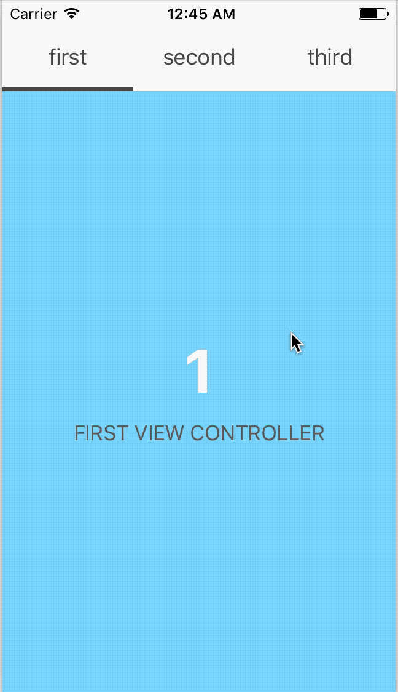

# SlidingPageTabViewController


Horizontally slidable paging viewController with tab menu

## Feature (on develop)
- [x] Horizontally scrolling a number of viewControllers.
- [x] Selectable a viewController as touch on tapBar menu.
- [x] Underline of menu will automatically move when user scroll viewControllers.
- [ ] Support changing device orientation.

## Demo


## How to use
```
let pageInfo = [["first": FirstViewController()],
				["second": SecondViewController()],
				["third": ThirdViewController()]]
let viewController = SlidingPageTabViewController(pageInfo)
```
1. Make a array that has element of dictionary.
 - Key of the dictionary is String type and it will shown as TabMenu's name on output screen.
 - Value of the dictionary is UIViewController type.
2. Make SlidingPageTabViewController has the array (be made on prev step) as parameter.